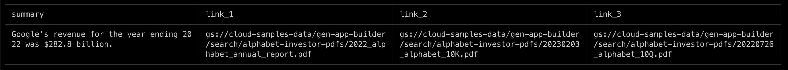
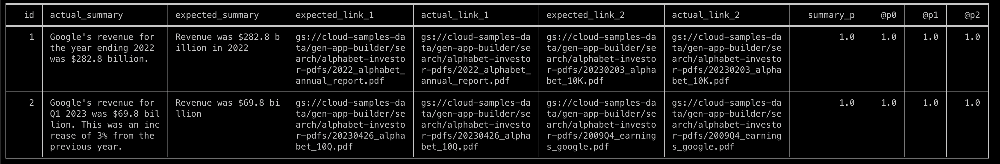

# Velvet 🔍 ✅ 
🔮 **V**ertex AI Search **Ve**rfication **T**ool

## Features
- Call [Vertex AI Search](https://cloud.google.com/enterprise-search) API from the command line
- Output to CSV, JSONL, Table format in terminal for a more human readable format
- Batch verification for Acceptance testing.
    - Ouputs Summary precision using Palm2 text-bison 
    - Outputs precision P@0, P@1, P@2 for document links. 
- Single Bash script [vlvt](vlvt) with minimal dependencies so its easy to integrate into CI pipelines.

## Examples
Examples using the Alphabet annual reports and 10K filings. See [this link](https://cloud.google.com/generative-ai-app-builder/docs/try-enterprise-search#create_and_preview_a_search_app_for_unstructured_data_from) on how to set it up.

Single search with table output.
```bash
./vlvt search "You are expert financial analyst. Be terse. Answer the question with minimal facts. What is Google's revenue for year ending 2022?" --format=table
```


Single search with csv output.
```bash
./vlvt search "You are expert financial analyst. Be terse. Answer the question with minimal facts. What is Google's revenue for year ending 2022?" --format=csv > batch_output.csv

```
Single search with jsonl output
```bash
./vlvt search "You are expert financial analyst. Be terse. Answer the question with minimal facts. What is Google's revenue for year ending 2022?" -f=jsonl > batch_output.jsonl

```
Batch search only with input file (batch_test_success.txt)[test/datatest/data/batch_test_success.txt] containing search queries and output a table.
```bash
./vlvt bsearch test/datatest/data/batch_test_success.txt --f=csv > batch_results.csv
```
Batch search AND verify with input file containing search queries with expected resutls and output results to a csv file.
```bash
./vlvt verify test/data/verification_test_success.csv --f=csv > verify_results.csv
```

Batch search AND verify with input file containing search queries with expected resutls and output results to table in terminal.
```bash
./vlvt verify test/data/verification_test_success.csv --f=table
```



## Install

### Prequesities
  - bash shell v4+
  - curl
  - jq
  - gcloud
  - Linux or macOS
  

Clone this repo or just copy the [vlvt](./vlvt) to your local  machine with bash support. Open termnial and change the permission to make it executable

```bash
chmod +x ./vlvt
```

## Setup

1. For MacOS users please ensure you have bash v4+ installed. To check run 
```bash
bash --version
```
To upgrade follow direction [here](https://itnext.io/upgrading-bash-on-macos-7138bd1066ba)

1. Setup [gcloud](https://cloud.google.com/sdk/docs/install-sdk) cli and authenticate to make sure you have access to the project with ES you want to query

2. Create Vertex AI search app. See [here](https://cloud.google.com/generative-ai-app-builder/docs/try-enterprise-search#create_and_preview_a_search_app_for_unstructured_data_from) on how to create one with all the Alphabet earnings reports pdfs. 

3. Export the following env variables.

```bash
$ export GCP_PROJECT_NUMBER=<vertex-ai-search-gcp-project-number> 
$ export DATASTORE_NAME=<vertex-ai-search-search_datastore_name> 
$ export PROJECT_ID=<palm-text-bison-project-id> # used by verify command to match summaries 
$ export LOCATION_ID=<palm-text-bison-region-name> # used by verify command to match summaries 
```
3. Install dependent tools. This installs [jtbl](https://github.com/kellyjonbrazil/jtbl) and verifies gcloud auth.

```bash
./vlvt init
```


## Usage


## Development

1. Install [bashly](https://bashly.dannyb.co/installation/) 
2. Git clone this repo and change to the directory
3. Generate the vlvt script 

```bash
bashly generate
```

4. Run the tests
```bash
./test.sh
```